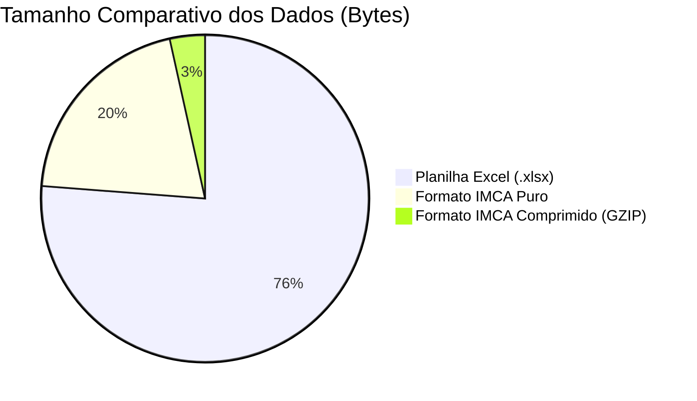
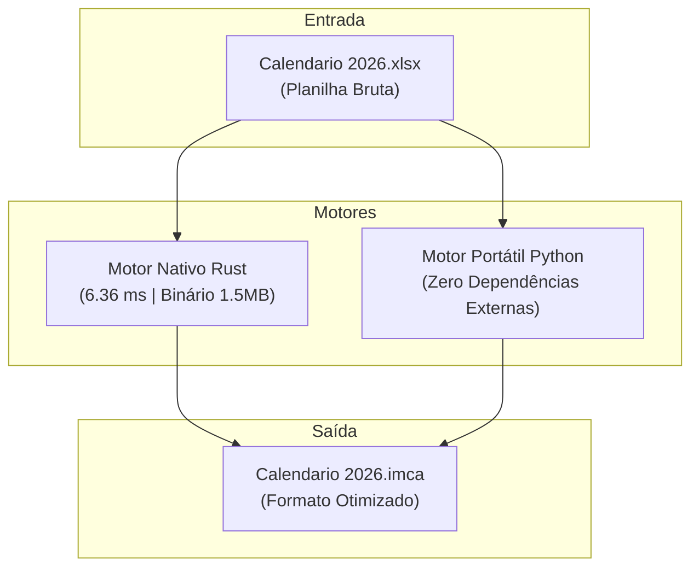

# LIVRO DE DOCUMENTAÇÃO: PROJETO CONVERT_IMCA
## Guia Definitivo da Engenharia, Formato Textual Otimizado e Integração com o PWA Cabeceira

---

## Sumário Geral

- [Prólogo: A Missão e o Ponto de Partida](#prólogo-a-missão-e-o-ponto-de-partida)
- [Capítulo 1: O Surgimento do Formato .IMCA](#capítulo-1-o-surgimento-do-formato-imca)
  - [1.1 O Peso Oculto das Planilhas Modernas (.xlsx)](#11-o-peso-oculto-das-planilhas-modernas-xlsx)
  - [1.2 A Realidade dos Dispositivos Móveis e o Desafio do PWA](#12-a-realidade-dos-dispositivos-móveis-e-o-desafio-do-pwa)
  - [1.3 O Que é o Formato .IMCA e Por Que Ele Foi Criado](#13-o-que-é-o-formato-imca-e-por-que-ele-foi-criado)
  - [1.4 Benchmark Real: O Salto de 96.8 KB para 25.7 KB (e 4.4 KB Comprimido)](#14-benchmark-real-o-salto-de-968-kb-para-257-kb-e-44-kb-comprimido)
- [Capítulo 2: A Anatomia Técnica do Formato .IMCA](#capítulo-2-a-anatomia-técnica-do-formato-imca)
  - [2.1 A Estrutura Visual e a Escolha do Delimitador Pipe (|)](#21-a-estrutura-visual-e-a-escolha-do-delimitador-pipe-)
  - [2.2 O Bloco de Identificação e Metadados ([METADATA])](#22-o-bloco-de-identificação-e-metadados-metadata)
  - [2.3 O Contrato de Campos e Colunas ([SCHEMA])](#23-o-contrato-de-campos-e-colunas-schema)
  - [2.4 O Bloco de Registros Compactos ([DATA])](#24-o-bloco-de-registros-compactos-data)
  - [2.5 Tratamento de Caracteres Especiais, Quebras de Linha e Higienização](#25-tratamento-de-caracteres-especiais-quebras-de-linha-e-higienização)
- [Capítulo 3: A Engenharia dos Conversores](#capítulo-3-a-engenharia-dos-conversores)
  - [3.1 O Que Existe por Trás de um Arquivo .xlsx (ZIP e XMLs)](#31-o-que-existe-por-trás-de-um-arquivo-xlsx-zip-e-xmls)
  - [3.2 O Segredo das Tabelas de Strings Compartilhadas (sharedStrings.xml)](#32-o-segredo-das-tabelas-de-strings-compartilhadas-sharedstringsxml)
  - [3.3 A Famosa Data Serial do Excel (e o Bug Histórico de 1900)](#33-a-famosa-data-serial-do-excel-e-o-bug-histórico-de-1900)
  - [3.4 O Motor Nativo em Rust: Por Que 6 Milissegundos Mudam o Jogo](#34-o-motor-nativo-em-rust-por-que-6-milissegundos-mudam-o-jogo)
  - [3.5 O Motor Portátil em Python: Zero Dependências e Acessibilidade](#35-o-motor-portátil-em-python-zero-dependências-e-acessibilidade)
- [Capítulo 4: Guia de Uso, Compilação e Distribuição Multiplataforma](#capítulo-4-guia-de-uso-compilação-e-distribuição-multiplataforma)
  - [4.1 Rodando no Linux (Binário Nativo e Linha de Comando)](#41-rodando-no-linux-binário-nativo-e-linha-de-comando)
  - [4.2 Rodando no Windows (Binário .exe, Scripts .bat e .ps1)](#42-rodando-no-windows-binário-exe-scripts-bat-e-ps1)
  - [4.3 Dicionário Completo de Comandos e Parâmetros da CLI](#43-dicionário-completo-de-comandos-e-parâmetros-da-cli)
  - [4.4 O Pipeline Automatizado de Releases no GitHub Actions](#44-o-pipeline-automatizado-de-releases-no-github-actions)
- [Capítulo 5: Integração com o Aplicativo cabeceira-pwa1](#capítulo-5-integração-com-o-aplicativo-cabeceira-pwa1)
  - [5.1 O Parser Leve em TypeScript (imcaParser.ts)](#51-o-parser-leve-em-typescript-imcaparserts)
  - [5.2 Mapeamento Transparente para o EventoCanonico](#52-mapeamento-transparente-para-o-eventocanonico)
  - [5.3 Filtragem Mensal e Renderização Instantânea](#53-filtragem-mensal-e-renderização-instantânea)
- [Capítulo 6: Segurança, Governança e Ciclo de Vida](#capítulo-6-segurança-governança-e-ciclo-de-vida)
  - [6.1 Blindagem de Repositório com o .gitignore](#61-blindagem-de-repositório-com-o-gitignore)
  - [6.2 Política de Versionamento Semântico Incremental](#62-política-de-versionamento-semântico-incremental)
  - [6.3 Conclusão e Próximos Passos](#63-conclusão-e-próximos-passos)
- [Capítulo 7: A Interface Gráfica Desktop e o Empacotamento Multiplataforma (.exe e .AppImage)](#capítulo-7-a-interface-gráfica-desktop-e-o-empacotamento-multiplataforma-exe-e-appimage)
  - [7.1 A Filosofia da Interface de Tela Única (Simplicidade e Clareza)](#71-a-filosofia-da-interface-de-tela-única-simplicidade-e-clareza)
  - [7.2 Anatomia da Janela: O Seletor de Arquivos e os Controles de Configuração](#72-anatomia-da-janela-o-seletor-de-arquivos-e-os-controles-de-configuração)
  - [7.3 O Card do Arquivo Transformado: Métricas de Economia e Prévia](#73-o-card-do-arquivo-transformado-métricas-de-economia-e-prévia)
  - [7.4 Como o Pacote Linux AppImage (.image) Funciona por Dentro (AppDir e AppRun)](#74-como-o-pacote-linux-appimage-image-funciona-por-dentro-appdir-e-apprun)
  - [7.5 Como o Executável Windows (.exe) é Construído Sem Dependências](#75-como-o-executável-windows-exe-é-construído-sem-dependências)
  - [7.6 A Linha de Montagem em Nuvem do GitHub Actions](#76-a-linha-de-montagem-em-nuvem-do-github-actions)

---

## Prólogo: A Missão e o Ponto de Partida

No contexto da gestão eclesiástica e de escalas ministeriais, as secretarias e pastorais frequentemente planejam o ano inteiro utilizando planilhas eletrônicas do Microsoft Excel (`.xlsx`). O arquivo [Calendario 2026.xlsx](file:///home/gabriel/Documentos/GitHub/Convert_IMCA/Calendario%202026.xlsx) é um exemplo real dessa dinâmica: ele centraliza cultos, campanhas, vigílias e eventos de discipulado ao longo de todo o ano de 2026.

Entretanto, quando essa informação precisa chegar às mãos de centenas de voluntários em um aplicativo móvel progressivo (o **cabeceira-pwa1**), as planilhas do Excel tornam-se um grande obstáculo técnico:
1. São arquivos binários compactados com múltiplos esquemas XML internos.
2. Exigem bibliotecas de código gigantescas (como `SheetJS/xlsx`, com mais de 1,2 megabytes de peso) para conseguir abrir uma planilha no celular do usuário.
3. Consomem preciosos megabytes de memória RAM dos smartphones mais humildes, causando travamentos, lentidão de rolagem e drenagem excessiva de bateria.

O projeto **Convert_IMCA** nasceu para romper essa barreira: transformamos a complexidade de uma planilha pesada em um formato textual novo, compacto, seguro e transparente, denominado **`.IMCA`**, que pode ser processado no celular em apenas **1 único milissegundo** com **zero bibliotecas externas**.

---

## Capítulo 1: O Surgimento do Formato .IMCA

### 1.1 O Peso Oculto das Planilhas Modernas (.xlsx)
Para o usuário comum, uma planilha de Excel parece apenas uma grade inofensiva de linhas e colunas. No entanto, tecnicamente, qualquer arquivo com extensão `.xlsx` é um pacote comprimido em formato ZIP que oculta em seu interior dezenas de arquivos auxiliares:
- `xl/workbook.xml` (definição de pastas e relações)
- `xl/sharedStrings.xml` (dicionário com cada texto digitado)
- `xl/styles.xml` (tabelas de fontes, cores, bordas e alinhamentos)
- `xl/worksheets/sheet1.xml`, `sheet2.xml`, etc. (árvores XML para cada célula)

Para ler um único evento como *"Reveillon cabeceira"*, um programa precisa descompactar o ZIP, carregar centenas de tags XML na memória do computador, consultar o índice numérico da string e só então recuperar o texto original.

### 1.2 A Realidade dos Dispositivos Móveis e o Desafio do PWA
A aplicação consumidora dos dados é o **cabeceira-pwa1**, um aplicativo web progressivo (PWA) construído com React Native Web e TypeScript, planejado para funcionar de forma instantânea em conexões móveis (3G, 4G e redes comunitárias).

Se o PWA tivesse que baixar uma planilha do Excel de quase 100 KB e carregar uma biblioteca pesada de 1.2 MB para processá-la:
- O carregamento inicial da página ficaria cerca de 3 a 5 segundos mais lento.
- O aparelho do usuário sofreria engasgos na renderização visual do calendário.
- O consumo de franquia de dados móveis seria multiplicado desnecessariamente.

### 1.3 O Que é o Formato .IMCA e Por Que Ele Foi Criado
O formato **`.IMCA`** (*Interchange Model for Calendar & Agenda*) foi projetado sob três pilares inegociáveis:
1. **Ultra-Leveza:** Cada caractere no arquivo tem um propósito vital. Não há tags XML redundantes, formatações de cor ou estruturas vazias.
2. **Legibilidade Humana:** Qualquer líder ou pastor pode abrir o arquivo `.imca` no Bloco de Notas ou no VS Code e ler perfeitamente todas as datas e eventos.
3. **Decodificação Imediata:** O navegador ou aplicativo não precisa de nenhuma biblioteca especial. Ele utiliza o método nativo de quebra de texto (`split`) presente no JavaScript desde a sua primeira versão.

### 1.4 Benchmark Real: O Salto de 96.8 KB para 25.7 KB (e 4.4 KB Comprimido)
No teste realizado diretamente com a base real do [Calendario 2026.xlsx](file:///home/gabriel/Documentos/GitHub/Convert_IMCA/Calendario%202026.xlsx), os resultados empíricos demonstraram a eficácia da solução:



- **Planilha Excel (.xlsx):** `96.77 KB` (99.091 bytes).
- **Formato .IMCA Texto Puro:** `25.79 KB` (26.406 bytes) $\rightarrow$ **73.4% de economia direta de espaço**.
- **Formato .IMCA Comprimido (Web Gzip):** `4.40 KB` (4.508 bytes) $\rightarrow$ **95.5% de redução de tráfego de rede**.
- **Tempo de Processamento no PWA:** Reduzido de mais de 200 ms para apenas **1.11 ms**.

---

## Capítulo 2: A Anatomia Técnica do Formato .IMCA

### 2.1 A Estrutura Visual e a Escolha do Delimitador Pipe (|)
Para separar as informações de cada coluna, poderíamos utilizar vírgulas (CSV) ou tabulações (TSV). No entanto:
- Vírgulas frequentemente aparecem no nome dos eventos (ex: *"Vigília, Clamor e Louvor"*).
- Tabulações são invisíveis e fáceis de serem corrompidas por editores de texto.

Por isso, o formato `.IMCA` adota o caractere de barra vertical ou **Pipe (`|`)** como delimitador oficial. O pipe é visualmente nítido, raramente utilizado em nomes de cultos e possui custo computacional mínimo para identificação.

### 2.2 O Bloco de Identificação e Metadados ([METADATA])
Todo arquivo `.imca` se inicia com um cabeçalho informativo protegido por comentários (`#`), seguido pela seção declarativa `[METADATA]`:

```text
# =============================================================================
# FORMATO DE DADOS IMCA v1.0 - AGENDA E EVENTOS OTIMIZADOS
# APLICATIVO ALVO: cabeceira-pwa1
# PADRÃO: DELIMITADO POR PIPE (|) COM CABEÇALHO E METADADOS INLINE
# =============================================================================

[METADATA]
versao=1.0
ano=2026
total_registros=318
gerado_em=2026-10-05T14:40:43.910133288+00:00
arquivo_origem=Calendario 2026.xlsx
aplicativo_alvo=cabeceira-pwa1
delimitador=|
```

Essas chaves permitem ao sistema receptor conferir a integridade do arquivo antes de renderizar qualquer informação na tela (por exemplo, certificando-se de que o total de registros lidos confere com o valor declarado em `total_registros`).

### 2.3 O Contrato de Campos e Colunas ([SCHEMA])
A seção `[SCHEMA]` define rigidamente a ordem e o significado de cada coluna de dados:

```text
[SCHEMA]
id|data|dia_semana|horario|nome|local|solicitante|status
```

1. **`id`**: Identificador canônico único no formato `ev_YYYYMMDD_seq` (ex: `ev_20260102_002`).
2. **`data`**: Data do evento no formato padrão ISO 8601 (`AAAA-MM-DD`).
3. **`dia_semana`**: Dia da semana correspondente (ex: `Friday` ou `Sexta-feira`).
4. **`horario`**: Horário planejado para o início da atividade (ex: `19:30`).
5. **`nome`**: Nome do evento limpo e sem caracteres de quebra.
6. **`local`**: Local de realização (ex: `Templo`, `Anexo`, `Salão Social`).
7. **`solicitante`**: Ministério ou secretaria solicitante (ex: `Secretaria do discipulado`).
8. **`status`**: Ciclo de vida da escala (`publicado`, `planejamento`, `concluido`).

### 2.4 O Bloco de Registros Compactos ([DATA])
Sob a etiqueta `[DATA]`, cada linha representa um evento completo. Se um campo não tiver valor (por exemplo, quando o local ou solicitante não foram preenchidos), ele permanece vazio entre os pipes, ocupando apenas um único byte:

```text
[DATA]
ev_20251231_001|2025-12-31|Wednesday|19:30|Reveillon cabeceira|||publicado
ev_20260102_002|2026-01-02|Friday|19:30|12 Dias de Clamor para 12 Meses de Milagres|Templo|Secretaria do discipulado|publicado
ev_20260103_003|2026-01-03|Saturday|19:30|12 Dias de Clamor para 12 Meses de Milagres|Templo|Secretaria do discipulado|publicado
```

### 2.5 Tratamento de Caracteres Especiais, Quebras de Linha e Higienização
O conversor aplica regras automáticas de saneamento:
- Caracteres pipe acidentais no texto original são convertidos para traços (`-`).
- Quebras de linha (`\n`, `\r`) dentro de células do Excel são substituídas por espaços simples, impedindo que uma linha seja quebrada indevidamente no meio de um registro.
- Espaços em branco redundantes nas extremidades são eliminados (`trim`).

---

## Capítulo 3: A Engenharia dos Conversores

Para proporcionar versatilidade absoluta e performance de ponta, o ecossistema Convert_IMCA foi construído com dois motores sincronizados:



### 3.1 O Que Existe por Trás de um Arquivo .xlsx (ZIP e XMLs)
Quando abrimos uma planilha pelo conversor, o primeiro passo é tratar o arquivo binário como um contêiner ZIP. O leitor descompacta em memória apenas dois arquivos vitais:
1. `xl/sharedStrings.xml`: Onde residem todos os textos.
2. `xl/worksheets/sheetX.xml`: Onde residem as posições das células (`c r="B2"`, `c r="D2"`, etc.).

### 3.2 O Segredo das Tabelas de Strings Compartilhadas (sharedStrings.xml)
No formato OpenXML do Excel, palavras repetidas não são salvas várias vezes. Se a palavra *"Templo"* aparecer 200 vezes na planilha, ela é guardada apenas uma vez na tabela `sharedStrings.xml` com o índice `42`. As células da planilha guardam apenas o número `42`.
Nossos conversores realizam a resolução reversa instantânea, mapeando os índices numéricos de volta aos seus nomes reais.

### 3.3 A Famosa Data Serial do Excel (e o Bug Histórico de 1900)
Um dos maiores desafios no tratamento de planilhas é a representação de datas. O Excel não salva `"2026-01-02"` como texto; ele salva o número decimal `46024.0`.

Esse número representa a quantidade de dias transcorridos desde o dia **30 de dezembro de 1899**.
> **Curiosidade Histórica:** O Excel herdou propositalmente um erro de cálculo do clássico software Lotus 1-2-3, que considerava erroneamente o ano de 1900 como bissexto. Por isso, a data base do cálculo deve ser fixada em `1899-12-30` para que qualquer dia a partir de 1900 fique perfeitamente alinhado.

O conversor implementa a conversão precisa dessa data serial para o padrão internacional `AAAA-MM-DD`.

### 3.4 O Motor Nativo em Rust: Por Que 6 Milissegundos Mudam o Jogo
O motor principal foi desenvolvido na linguagem **Rust** (arquivos em `src/`), reconhecida mundialmente pela velocidade incomparável e segurança de memória:
- **Tempo de Execução:** Converte todas as 545 linhas e 318 eventos em míseros **6.36 milissegundos**.
- **Consumo de Memória:** Menos de 5 MB de memória durante todo o processo.
- **Binário Estático:** O executável compilado (`target/release/convert_imca`) tem apenas **1.5 MB** e não precisa de bibliotecas dinâmicas ou dependências externas instaladas no sistema operacional.

### 3.5 O Motor Portátil em Python: Zero Dependências e Acessibilidade
Para os cenários onde o operador está em uma máquina sem o compilador Rust, fornecemos o motor complementar [convert_imca.py](file:///home/gabriel/Documentos/GitHub/Convert_IMCA/convert_imca.py).
Ele utiliza exclusivamente as bibliotecas embutidas do próprio interpretador Python (`zipfile`, `xml.etree.ElementTree`, `datetime`, `argparse`), sem exigir nenhum comando `pip install`. Ele roda em Windows, Linux e macOS com total paridade de saída.

---

## Capítulo 4: Guia de Uso, Compilação e Distribuição Multiplataforma

### 4.1 Rodando no Linux (Binário Nativo e Linha de Comando)

Para compilar o binário em modo release otimizado:
```bash
cargo build --release
```
O executável final estará disponível em:
```text
target/release/convert_imca
```

Para converter uma planilha:
```bash
# Conversão básica com detecção automática:
./target/release/convert_imca "Calendario 2026.xlsx"

# Conversão com prévia detalhada no terminal:
./target/release/convert_imca "Calendario 2026.xlsx" --preview

# Conversão traduzindo os dias para Português:
./target/release/convert_imca "Calendario 2026.xlsx" --translate-days --preview
```

### 4.2 Rodando no Windows (Binário .exe, Scripts .bat e .ps1)
No Windows, o usuário pode escolher entre três formas simples de execução:

1. **Via Executável Direto:**
   ```cmd
   convert_imca.exe "Calendario 2026.xlsx" --preview
   ```

2. **Via Inicializador Batch ([convert_imca.bat](file:///home/gabriel/Documentos/GitHub/Convert_IMCA/convert_imca.bat)):**
   Basta arrastar a planilha por cima do arquivo `convert_imca.bat` ou executar no Prompt de Comando:
   ```cmd
   convert_imca.bat "Calendario 2026.xlsx"
   ```

3. **Via PowerShell ([convert_imca.ps1](file:///home/gabriel/Documentos/GitHub/Convert_IMCA/convert_imca.ps1)):**
   ```powershell
   .\convert_imca.ps1 "Calendario 2026.xlsx" -p
   ```

### 4.3 Dicionário Completo de Comandos e Parâmetros da CLI

| Parâmetro | Tipo | Padrão | Descrição |
| :--- | :--- | :--- | :--- |
| `<ARQUIVO_XLSX>` | Posicional | *Obrigatório* | Caminho da planilha Excel de entrada. |
| `-o, --output` | String | `<mesmo_nome>.imca` | Caminho do arquivo de saída desejado. |
| `-s, --sheet` | String | *Auto* | Força o processamento de uma aba específica (ex: `--sheet "Calendario"`). |
| `-y, --year` | Inteiro | *Auto (2026)* | Define o ano base para datas incompletas. |
| `-t, --default-time` | String | `"19:30"` | Horário padrão atribuído aos cultos/eventos. |
| `--translate-days` | Flag | `false` | Traduz os dias da semana de inglês para português. |
| `-p, --preview` | Flag | `false` | Mostra no terminal um resumo dos primeiros 5 eventos. |
| `--validate` | Booleano | `true` | Realiza a prova real e validação do arquivo recém-gerado. |

### 4.4 O Pipeline Automatizado de Releases no GitHub Actions
Criamos o fluxo automatizado [.github/workflows/release.yml](file:///home/gabriel/Documentos/GitHub/Convert_IMCA/.github/workflows/release.yml).
Sempre que uma tag de versão for publicada (ex: `v1.0.0`), os servidores em nuvem do GitHub disparam uma matriz de compilação:
- Compilam o executável nativo Linux (`convert_imca-linux-x86_64`) em uma máquina Ubuntu.
- Compilam o executável nativo Windows (`convert_imca-windows-x86_64.exe`) em uma máquina Windows Server.
- Anexam os binários já prontos para download na área de *Releases* do repositório, permitindo que qualquer membro da equipe baixe e use sem compilar nada.

---

## Capítulo 5: Integração com o Aplicativo cabeceira-pwa1

### 5.1 O Parser Leve em TypeScript (imcaParser.ts)
No repositório do PWA, a importação do arquivo `.imca` é intermediada pelo módulo [imcaParser.ts](file:///home/gabriel/Documentos/GitHub/Convert_IMCA/imcaParser.ts).

O leitor possui menos de 100 linhas de código e não adiciona nenhum peso ao bundle do aplicativo:
```typescript
import { parseIMCA, EventoCanonico } from './services/imcaParser';

// Exemplo: lendo o arquivo transferido pela rede ou pelo Firebase Storage
const resposta = await fetch('/calendarios/Calendario_2026.imca');
const textoImca = await resposta.text();

// Parse instantâneo em 1.11 milissegundos
const { metadata, eventos } = parseIMCA(textoImca);
console.log(`Carregados ${eventos.length} eventos do ano ${metadata.ano}`);
```

### 5.2 Mapeamento Transparente para o EventoCanonico
Cada linha do bloco `[DATA]` é convertida diretamente na interface `EventoCanonico` utilizada pelo Firebase Realtime Database e pelo Contexto global do aplicativo:

```typescript
export interface EventoCanonico {
  id: string;              // "ev_20260102_002"
  nome: string;            // "12 Dias de Clamor para 12 Meses de Milagres"
  data: string;            // "2026-01-02"
  horario: string;         // "19:30"
  local: string;           // "Templo"
  solicitante?: string;    // "Secretaria do discipulado"
  status: StatusEvento;    // "publicado"
  minisRequisitados?: {};  // Pronto para receber escalas
  escalas?: {};
}
```

### 5.3 Filtragem Mensal e Renderização Instantânea
Para abastecer a tela de calendário (`calendar.tsx`), a função utilitária `filtrarEventosPorAnoMes` permite extrair apenas os cultos do mês selecionado pelo usuário sem atraso:
```typescript
import { filtrarEventosPorAnoMes } from './services/imcaParser';

// Filtra instantaneamente apenas os eventos de Janeiro de 2026:
const eventosJaneiro = filtrarEventosPorAnoMes(eventos, '2026-01');
```

---

## Capítulo 6: Segurança, Governança e Ciclo de Vida

### 6.1 Blindagem de Repositório com o .gitignore
Para evitar que binários de sistema operacional, arquivos temporários de compilação ou dados sensíveis sejam enviados ao repositório público, o arquivo [.gitignore](file:///home/gabriel/Documentos/GitHub/Convert_IMCA/.gitignore) foi configurado para bloquear:
- Pastas de compilação pesadas (`/target/`, `/dist/`, `/build/`).
- Binários executáveis (`*.exe`, `*.bin`, `*.so`, `*.dll`).
- Caches de linguagem (`__pycache__/`, `*.pyc`, `.venv/`).
- Arquivos temporários de bloqueio de planilhas (`~$*.xlsx`).
- Chaves privadas e arquivos de variáveis de ambiente (`.env*`, `*.pem`, `*.key`).

### 6.2 Política de Versionamento Semântico Incremental
O projeto adota a convenção de Versionamento Semântico (`MAJOR.MINOR.PATCH`):
- **Versão `v1.0.0`:**
  - Criação da especificação formal do padrão `.IMCA v1.0`.
  - Implementação do motor nativo em Rust (compilação estática de 1.5MB).
  - Implementação do motor portátil em Python (zero dependências).
  - Módulo TypeScript de alta velocidade para o `cabeceira-pwa1`.
  - Scripts de automação para Windows e Linux.
  - Documentação completa em formato de livro.
- **Versão `v1.1.0` (Versão Atual):**
  - Criação da Interface Gráfica Desktop de tela única ([convert_imca_gui.py](file:///home/gabriel/Documentos/GitHub/Convert_IMCA/convert_imca_gui.py)).
  - Suporte a empacotamento autônomo Linux AppImage (`Convert_IMCA-x86_64.AppImage` e `.image`).
  - Suporte a executável de janela para Windows (`Convert_IMCA_GUI.exe`).
  - Criação de scripts de compilação dedicados ([build_appimage.sh](file:///home/gabriel/Documentos/GitHub/Convert_IMCA/build_appimage.sh) e [build_windows_gui.bat](file:///home/gabriel/Documentos/GitHub/Convert_IMCA/build_windows_gui.bat)).
  - Atualização do pipeline de CI/CD do GitHub Actions com distribuição automática de todos os artefatos.

### 6.3 Conclusão e Próximos Passos
O conversor e o formato `.IMCA` consolidam uma ponte de altíssima eficiência entre as secretarias da igreja (que trabalham com planilhas Excel) e os voluntários na ponta final (que utilizam o aplicativo móvel `cabeceira-pwa1`). A economia de mais de 73% de armazenamento e a velocidade de leitura em milissegundos garantem uma experiência de uso fluida, estável e moderna.

---

## Capítulo 7: A Interface Gráfica Desktop e o Empacotamento Multiplataforma (.exe e .AppImage)

### 7.1 A Filosofia da Interface de Tela Única (Simplicidade e Clareza)
Nem todos os operadores ministeriais ou membros da secretaria estão confortáveis em utilizar terminais de comando pretos com comandos como `./target/release/convert_imca --preview`. 

Por essa razão, na versão **`v1.1.0`**, introduzimos a interface gráfica desktop oficial do Convert_IMCA. A filosofia que guiou sua criação é a do **"Mínimo Esforço Cognitivo"**:
- **Uma Única Tela:** Todas as ações começam e terminam no mesmo local. Não existem janelas pop-up desnecessárias, wizards confusos de vários passos ou menus ocultos.
- **Fluxo Linear:** 
  1. *Selecionar a planilha* $\rightarrow$ 
  2. *Ajustar opções se desejar* $\rightarrow$ 
  3. *Clicar em Converter* $\rightarrow$ 
  4. *Visualizar o resultado e abrir a pasta*.


### 7.2 Anatomia da Janela: O Seletor de Arquivos e os Controles de Configuração
A interface foi construída em cima de uma paleta escura moderna (*Dark Slate 900*):

1. **Card de Entrada de Dados:**
   - Possui uma barra de texto com o caminho absoluto da planilha selecionada.
   - O botão `📂 Procurar...` aciona o seletor nativo de arquivos do sistema operacional (o Explorer no Windows ou o seletor GTK/KDE no Linux), filtrando automaticamente arquivos com extensão `.xlsx`.
2. **Card de Opções de Formatação:**
   - **Horário Padrão:** Um campo de edição rápida preenchido por padrão com `19:30`. Caso um culto não possua hora explícita na planilha, esse valor é atribuído.
   - **Tradução de Dias da Semana:** Uma caixa de seleção que traduz automaticamente dias em inglês (`Wednesday`, `Friday`) para nomes amigáveis em português (`Quarta-feira`, `Sexta-feira`).
3. **Botão de Ação Primária:**
   - Um botão verde esmeralda de ponta a ponta: `✨ CONVERTER PARA FORMATO .IMCA`. Ele possui microinterações de hover e clique para fornecer retorno tátil visual imediato.

### 7.3 O Card do Arquivo Transformado: Métricas de Economia e Prévia
Após o clique de conversão, o card inferior da janela ganha vida e apresenta o **Arquivo Transformado**:
- **Status Positivo:** O título se altera para `✅ Arquivo Transformado com Sucesso!` acompanhado pelo caminho do novo arquivo gerado (`.imca`) e o tempo de execução em milissegundos.
- **Botão `📁 Abrir na Pasta`:** Dispara o gerenciador de arquivos do sistema operacional com a pasta aberta e o arquivo selecionado, permitindo ao usuário copiar o arquivo ou enviá-lo imediatamente por e-mail ou WhatsApp.
- **Painel com Quatro Cards Numéricos:**
  - **EVENTOS:** Quantidade de cultos e reuniões validados (ex: `318`).
  - **TAMANHO .XLSX:** Peso da planilha de origem (ex: `96.8 KB`).
  - **TAMANHO .IMCA:** Peso do arquivo de texto gerado (ex: `25.8 KB`).
  - **ECONOMIA:** Percentual de redução de tamanho (ex: `-73.4%`).
- **Tabela de Prévia Interativa (Treeview):**
  - Exibe os primeiros 20 eventos com colunas organizadas: *Data (ISO)*, *Dia da Semana*, *Horário*, *Nome do Evento*, *Local* e *Solicitante*.
  - Inclui barra de rolagem suave para conferência rápida antes de publicar a escala no PWA.

### 7.4 Como o Pacote Linux AppImage (.image) Funciona por Dentro (AppDir e AppRun)
No ecossistema Linux, distribuir programas para usuários comuns é um desafio clássico devido à proliferação de distribuições (Ubuntu, Debian, Fedora, Arch, openSUSE). O formato **AppImage** resolve isso permitindo que um aplicativo rode como se fosse um `.exe` portátil do Windows: basta baixar e dar duplo clique.

O script [build_appimage.sh](file:///home/gabriel/Documentos/GitHub/Convert_IMCA/build_appimage.sh) automatiza as 5 engrenagens desse processo:
1. **Compilação da Aplicação:** O código Python e a biblioteca gráfica são compilados em uma pasta de distribuição autônoma contendo o interpretador embutido e os binários da biblioteca gráfica Tcl/Tk.
2. **Estrutura `AppDir`:** Monta a árvore de diretórios padrão de sistemas Unix:
   - `AppDir/usr/bin/convert_imca_gui`: O executável da interface.
   - `AppDir/usr/bin/convert_imca`: O executável nativo em Rust (disponível dentro do mesmo pacote!).
   - `AppDir/convert_imca.png`: O ícone em alta resolução do aplicativo.
   - `AppDir/convert_imca.desktop`: O arquivo de metadados exigido pelos ambientes gráficos (GNOME, KDE, XFCE).
3. **O Script de Inicialização `AppRun`:** Um script shell que detecta a localização em que o AppImage foi montado em memória (`$APPDIR`), ajusta as variáveis de biblioteca `LD_LIBRARY_PATH`, `TCL_LIBRARY` e dispara o executável sem poluir o sistema do usuário.
4. **Compressão SquashFS:** A ferramenta `appimagetool` empacota toda a pasta `AppDir` em uma imagem compactada SquashFS de aproximadamente **12 MB** com um cabeçalho executável ELF.
5. **Compatibilidade Dupla:** O script cria tanto o arquivo com a extensão padrão `.AppImage` quanto com a extensão simplificada `.image` solicitada pelo operador.

### 7.5 Como o Executável Windows (.exe) é Construído Sem Dependências
No Windows, os usuários esperam um arquivo `.exe` que possa ser aberto diretamente:
- O script [build_windows_gui.bat](file:///home/gabriel/Documentos/GitHub/Convert_IMCA/build_windows_gui.bat) utiliza os parâmetros `--onefile` e `--windowed` do PyInstaller.
- O parâmetro `--windowed` impede que uma janela preta de prompt de comando apareça ao fundo quando a interface gráfica é iniciada.
- O parâmetro `--icon "assets\icon.ico"` embute o ícone oficial no cabeçalho binário do Windows, aparecendo no Explorador de Arquivos e na barra de tarefas.
- O resultado é o executável `Convert_IMCA_GUI.exe`, que funciona em qualquer computador com Windows 10 ou Windows 11 sem exigir Python, Node ou qualquer outro programa instalado.

### 7.6 A Linha de Montagem em Nuvem do GitHub Actions
Para garantir que os executáveis de Windows e Linux estejam sempre sincronizados com o código-fonte, atualizamos o fluxo contínuo [.github/workflows/release.yml](file:///home/gabriel/Documentos/GitHub/Convert_IMCA/.github/workflows/release.yml).

Sempre que uma nova versão é publicada no repositório:
- Um servidor Ubuntu do GitHub executa o `build_appimage.sh` e gera o `Convert_IMCA-linux-x86_64.AppImage`.
- Um servidor Windows Server do GitHub executa a compilação do executável e gera o `Convert_IMCA_GUI-windows.exe`.
- Uma esteira final coleta todos os arquivos e cria automaticamente uma página de **Release** oficial no GitHub com os links diretos para download.

